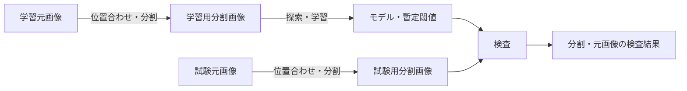

# Visual Inspection SuperSimpleNet

SuperSimpleNetを使用し、型番ごとの画像準備、異常検出モデルの学習、外観検査をローカルCLIで実行するプロジェクトである。

大容量の元画像を基準画像へ位置合わせして分割し、正常画像中心のデータから評価用モデルと暫定閾値を生成する。検査では分割画像ごとの異常スコアと可視化画像を保存し、元画像単位の判定へ集約する。

> [!IMPORTANT]
> 現在のモデルと閾値は初期評価用である。異常スコアは校正済み確率ではなく、検出性能、誤検出率、処理時間の本番受け入れ基準も別途決定する必要がある。このリポジトリのワークフローが完了したことだけを、本番利用の承認として扱わない。

## 動作環境

- Python 3.13
- `uv`
- Ubuntu 24.04 LTS または Windows 11（x86-64）
- 対応GPUは任意。CUDAを利用できない場合はCPUへ切り替える
- Node.js 22とnpm（OpenSpecの操作および開発時の品質検査に使用）

依存関係を同期する。

```bash
uv sync --locked
npm ci
```

Dev Containerを利用する場合は、Docker EngineとDev Containers対応エディターを用意し、このリポジトリをコンテナで開く。コンテナ作成時にPythonとNode.jsの依存関係が同期される。

## 外観検査ワークフロー

ワークフローは、画像準備、モデル学習、モデル評価の3つの能力で構成される。



仕様の分割理由、責務境界、仕様間の関係は[外観検査仕様ガイド](openspec/specs/visual-inspection/README.md)を参照する。

### 1. 入力を用意する

対象型番ごとに設定と画像を配置する。`<model>`には、英数字から始まる英数字・`_`・`-`だけを使用できる。

| 入力 | 内容 |
| --- | --- |
| `config/setting.ini` | 全型番共通の分割画像サイズ |
| `config/part_<model>.json` | 型番別の分割、位置合わせ、探索、拡張、閾値設定 |
| `data/01_original_train/<model>/` | 基準画像と正常中心の学習元画像 |
| `data/02_original_test/<model>/` | 検査対象の試験元画像 |

[config/part_XX.json](config/part_XX.json)を型番別設定のひな形として利用できる。`base`には`data/01_original_train/<model>/`直下の基準画像ファイル名を指定し、`range`には分割IDと左上座標を設定する。学習対象から除外する元画像と分割IDは`blacklist`で指定する。

### 2. 分割範囲を確認する

```bash
uv run --locked check --model XX
```

基準画像へ分割範囲と分割IDを重ねた`data/03_check/XX.png`を確認し、全ての範囲が意図した検査対象を覆っていることを目視で確認する。

### 3. 学習画像を準備する

```bash
uv run --locked train-pre --model XX
```

学習元画像を基準画像へ位置合わせし、ブラックリストを除外して分割画像とmanifestを`data/04_train/XX/`へ保存する。位置合わせに失敗した元画像は理由付きで学習対象から除外される。

### 4. モデルを学習する

```bash
uv run --locked train --model XX
```

元画像単位で学習用と検証用へ分離し、Optunaによる探索を実行する。通常の再実行では`optuna/XX/study.db`にある探索履歴を使用して未完了試行から再開する。

探索履歴とモデルを破棄して最初から実行する場合だけ、`--restart`を指定する。

```bash
uv run --locked train --model XX --restart
```

### 5. 試験画像を準備する

```bash
uv run --locked test-pre --model XX
```

試験元画像を位置合わせ・分割し、分割画像とmanifestを`data/05_test/XX/`へ保存する。試験画像には学習用ブラックリストを適用しない。位置合わせに失敗した画像は正常とせず、後続の検査へ`undetermined`として引き継ぐ。

### 6. 検査する

```bash
uv run --locked test --model XX
```

型番別モデルと暫定閾値を全分割画像へ適用し、結果画像と元画像単位のJSONを`data/06_result/XX/`へ保存する。

既存の検査結果だけを削除して再生成する場合は、`--restart`を指定する。

```bash
uv run --locked test --model XX --restart
```

## 判定とエラーの扱い

元画像の判定は、分割画像の結果から次の優先順位で集約する。

| 条件 | 元画像の判定 |
| --- | --- |
| 1つ以上の分割が`anomaly` | `anomaly` |
| 必要な全分割が`normal` | `normal` |
| 上記以外。位置合わせ失敗、分割不足、推論失敗などを含む | `undetermined` |

`undetermined`は正常を意味しない。結果JSONの理由と案内を確認し、原則として再撮影する。異なる扱いが必要な場合は評価者が判断する。

全CLIは共通の終了コードを使用する。

| 終了コード | 意味 |
| --- | --- |
| `0` | 成功 |
| `2` | 設定、入力、成果物契約の不備 |
| `3` | 画像I/Oや学習・推論などの処理失敗 |

各コマンドの標準出力と検査結果JSONには、開始・終了日時、処理時間、終了状態、OS、Python・主要依存関係、使用デバイス、警告、エラーを記録する。

## 成果物

| 成果物 | 保存先 |
| --- | --- |
| 分割位置の確認画像 | `data/03_check/<model>.png` |
| 学習用分割画像とmanifest | `data/04_train/<model>/` |
| 試験用分割画像とmanifest | `data/05_test/<model>/` |
| Optuna studyと最良試行 | `optuna/<model>/study.db`、`optuna/<model>/best_trial.json` |
| 学習済みcheckpoint | `weights/<model>.ckpt` |
| 分割結果画像と元画像単位のJSON | `data/06_result/<model>/` |
| 事前学習重みキャッシュ | `pretrained/` |

`--restart`は対象型番の派生成果物を削除してから再生成する。旧成果物が必要な場合は、実行前にリポジトリ外などの任意の場所へ退避する。元画像、型番設定、事前学習重みキャッシュは削除されない。

## 実機スモーク試験

運用受け入れ前に、Ubuntu 24.04 LTSとWindows 11の実機で、GPUを利用する経路とGPUを利用できない場合のCPU経路を確認する。少量の評価用データを配置し、各OSでGPU利用可能時とGPU無効化時にそれぞれ次を実行する。証跡が上書きされないよう、`--output`には実行ごとに異なるパスを指定する。

```bash
uv run --locked python scripts/run_visual_inspection_smoke.py \
  --model XX \
  --output smoke/visual-inspection-XX.json
```

生成したJSONは試験証跡として保存する。本番利用の性能・誤検出基準は、このスモーク試験とは別に評価する。

## 仕様

正式仕様は`openspec/specs/`で管理する。外観検査は、主な責務と成果物が異なる次の3能力に分割されている。

| 能力 | 対象 |
| --- | --- |
| [`visual-inspection/image-preparation`](openspec/specs/visual-inspection/image-preparation/spec.md) | 基準画像、位置合わせ、分割、ブラックリスト、準備manifest |
| [`visual-inspection/model-training`](openspec/specs/visual-inspection/model-training/spec.md) | 学習・検証分離、探索、データ拡張、モデル・閾値、再開 |
| [`visual-inspection/model-evaluation`](openspec/specs/visual-inspection/model-evaluation/spec.md) | デバイス選択、推論、可視化、判定集約、結果契約、再検査 |

`openspec/specs/visual-inspection/`は能力を整理する名前空間であり、親specではない。詳細は[外観検査仕様ガイド](openspec/specs/visual-inspection/README.md)を参照する。

利用者や外部システムから観測できる振る舞いを変更する場合は、実装前にOpenSpec changeを作成する。共通方針は[AGENTS.md](AGENTS.md)、プロダクト・技術・配置の前提は[product.md](openspec/product.md)、[tech.md](openspec/tech.md)、[structure.md](openspec/structure.md)を参照する。

## 開発

コミット前の基礎検査を実行する。初回だけpre-commitフックを有効化する。

```bash
uv run --locked pre-commit install
uv run --locked pre-commit run --all-files
```

統合前の品質検査は、OpenSpecの検証、format、lint、型検査、テスト、リポジトリ検査、進行中changeのトレーサビリティ検査をまとめて実行する。

```bash
npm run check
```

個別に実行する場合は次のコマンドを使用する。

```bash
uv run --locked pytest
uv run --locked ruff check .
uv run --locked ruff format --check .
uv run --locked pyright
npx --no-install openspec validate --all --strict
```

OpenSpecを更新する場合は、プロジェクトローカルのCLIとロックファイルを先に更新し、生成済みのエージェント向けinstructionsを更新する。

```bash
npm install --save-dev @fission-ai/openspec@latest
npx --no-install openspec update
```
