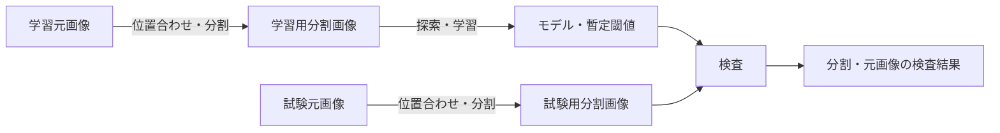

# Visual Inspection SuperSimpleNet

SuperSimpleNetを使用し、型番ごとの画像準備、異常検出モデルの学習、外観検査をローカルCLIで実行するプロジェクトである。

大容量の元画像を基準画像へ位置合わせして分割し、正常画像中心のデータから評価用モデルと暫定閾値を生成する。<br />
検査では分割画像ごとの異常スコアと可視化画像を保存し、元画像単位の判定へ集約する。

> [!IMPORTANT]
> 現在のモデルと閾値は初期評価用である。<br />
> 異常スコアは校正済み確率ではなく、検出性能、誤検出率、処理時間の本番受け入れ基準も別途決定する必要がある。<br />
> このリポジトリのワークフローが完了したことだけを、本番利用の承認として扱わない。

## よく使う用語

初めて参加する開発者向けの短い説明である。<br />
振る舞いと受け入れ条件の正本は[正式仕様](openspec/specs/visual-inspection/README.md)と該当する change に置く。

| 用語 | 意味 |
| --- | --- |
| 型番 | 設定、入力画像、モデル、結果をひも付ける対象製品の識別子 |
| `model` | CLI の `--model` や設定・成果物の `model` が示す処理対象の型番。<br />学習済みモデルそのものは指さない |
| 基準画像 | 型番ごとの分割範囲を定め、元画像の位置合わせ先となる画像 |
| 元画像 | 学習または検査のために入力する、分割前の画像 |
| 分割画像 | 元画像を基準画像へ位置合わせし、設定された範囲で切り出した画像 |
| 準備manifest | 元画像と分割画像の対応、および準備結果を後続処理へ引き渡す記録 |
| checkpoint | 学習したモデルと、対応する型番・スコア契約・暫定閾値を保存した成果物 |
| 異常スコア | SuperSimpleNet の `pred_score`。校正済み確率ではない |
| 暫定閾値 | 学習データの異常スコアから算出する、初期評価用の判定境界 |
| 検査用閾値 | 型番設定の `inspection_threshold`。<br />指定時に検査判定へ使用する値 |
| `undetermined` (未判定) | 位置合わせ失敗や分割不足などで、元画像を正常と確定できない判定 |
| capability (仕様上の能力) | 継続して管理する機能・責務の単位。<br />このプロジェクトでは画像準備、モデル学習、モデル評価の3つ |
| OpenSpec change | 一回の変更を計画・実装・検証する単位。<br />capabilityとは別に管理する |

## 動作環境

- Python 3.13
- `uv`
- Ubuntu 24.04 LTS または Windows 11 (x86-64)
- 対応GPUは任意。CUDAを利用できない場合はCPUへ切り替える
- Node.js 22とnpm (OpenSpecの操作および開発時の品質検査に使用)

Dev Containerを使わずに開発する場合は、依存関係を同期する。

```bash
uv sync --locked
npm ci
```

Dev Containerを利用する場合は、Docker EngineとDev Containers対応エディターを用意し、このリポジトリをコンテナで開く。<br />
コンテナ作成時に`uv sync --locked`と`npm ci`が自動実行されるため、初回起動後に同じコマンドを手動で実行する必要はない。

## 外観検査ワークフロー

ワークフローは、画像準備、モデル学習、モデル評価の3つの能力で構成される。



仕様の分割理由、責務境界、仕様間の関係は[外観検査仕様ガイド](openspec/specs/visual-inspection/README.md)を参照する。

### 1. 入力を用意する

対象型番ごとに設定と画像を配置する。<br />
`<model>`には、英数字から始まる英数字・`_`・`-`だけを使用できる。

| 入力 | 内容 |
| --- | --- |
| `config/setting.ini` | 全型番共通の元画像縮小倍率と分割画像サイズ |
| `config/part_<model>.json` | 型番別の分割、位置合わせ、探索、拡張、閾値設定 |
| `data/01_original_train/<model>/` | 基準画像と正常中心の学習元画像 |
| `data/02_original_test/<model>/` | 検査対象の試験元画像 |

`data/` はリポジトリに含まれない。<br />
開発者または運用者が対象型番の `data/01_original_train/<model>/` と `data/02_original_test/<model>/` を事前に作成し、元画像を配置する。<br />
確認画像・分割画像・検査結果の出力先は、各CLIが必要に応じて作成する。

#### 全体設定：`config/setting.ini`

[setting.ini](config/setting.ini)の`[IMAGE] SIZE`に、切り出す正方形の一辺をピクセル単位の正の整数で指定する。<br />
`[IMAGE] RESIZE`には、位置合わせ前に基準画像と元画像の縦横へ適用する倍率を0より大きく1以下で指定する。<br />
`RESIZE = 0.5`なら縦横の画素数は半分になり、縮小には画質劣化を抑える面積補間を使用する。<br />
`RESIZE`を省略した既存設定は倍率1として扱う。<br />
設定値は全型番に適用される。<br />
`SIZE = 500`なら各分割範囲は500×500ピクセルとなる。<br />
`SIZE`は縮小後も変わらず、`range`の座標は縮小前の基準画像を基準とする。<br />
例えば`RESIZE = 0.5`で元画像上の`x = 400`を指定すると、縮小後の`x = 200`から`SIZE`ピクセル四方を切り出す。<br />
座標に倍率を掛けた値は、小数部が0.5以上なら切り上げる。<br />
値と同じ行にコメントを記載しない。

#### 型番別設定：`config/part_<model>.json`

[part_XX.json](config/part_XX.json)をひな形として型番ごとに用意する。<br />
例えば型番`AB-01`には`config/part_AB-01.json`を配置し、`--model AB-01`で読み込む。<br />
主な項目は次のとおり。

| 項目 | 設定内容 |
| --- | --- |
| `base` | `data/01_original_train/<model>/`直下にある基準画像のファイル名。<br />ディレクトリを含むパスは指定できない |
| `range` | 分割範囲の配列。<br />各要素の`id`は0〜99の一意な分割ID、`x`・`y`は縮小前の基準画像の左上を原点とする切り出し開始座標。<br />範囲の一辺には縮小後も`SIZE`を使用する |
| `blacklist` | 学習準備から除外する元画像名`image`と分割IDの配列`id`。試験準備には適用しない |
| `inspection_threshold` | 任意の検査用閾値。<br />未指定または`null`なら暫定閾値を使い、0〜1の数値ならその値を`test`の判定に使う |
| `alignment` | ORB位置合わせのKNN近傍候補数`knn_k` (2)、比率判定閾値`ratio_threshold` (0.75)、最低対応点数 (10)、RANSAC再投影誤差 (8.0px)・信頼確率 (0.95)、最低インライア比率 (0.2) |
| `optuna_settings.search` | 学習率倍率、バッチサイズ、エポック数、特徴層、前処理画像サイズの探索候補。正規化・補間・antialiasの設定も含む |
| `optuna_settings.sampler`・`pruner` | Optunaの乱数seedと枝刈り条件 |
| `optuna_settings.normal_only` | 元画像単位の学習・検証比率、乱数seed、探索目的値に使用する検証スコアのパーセンタイル |
| `optuna_settings.execution` | 探索試行回数、乱数seed、探索再開の設定 |
| `optuna_settings.threshold` | 学習集合のスコアから暫定閾値を算出する方法・パーセンタイル・スコア源。<br />`value`は初回学習前に`null`とし、学習完了時に更新される |
| `score` | 異常スコア源。<br />`supersimplenet.pred_score`を使用し、Anomalib PostProcessorを無効にする |
| `augmentation` | 学習入力だけに適用するデータ拡張。<br />`enabled`で全体を切り替え、`order`と各変換の`enabled`・`probability`・強度で内容を指定する |

`blacklist`の指定例は`{"image": "sample.png", "id": [0, 1]}`である。<br />
`image`には学習元画像の拡張子付きファイル名を指定する。<br />
`range`に存在しない分割IDや、学習元画像に存在しないファイル名は指定できない。

`score.source`と`optuna_settings.threshold.score_source`は一致させ、PostProcessorを有効にしない。<br />
学習後の`threshold.value`はcheckpointと`best_trial.json`にも同じ値が保存されるため、設定ファイルだけを手動で変更しない。<br />
検査用閾値を変えるときは`inspection_threshold`を編集し、`test`を再実行する。<br />
学習時に更新されるのは暫定閾値であり、検査用閾値は保持される。<br />
設定値の規範的な条件は[画像準備仕様](openspec/specs/visual-inspection/image-preparation/spec.md)と[モデル学習仕様](openspec/specs/visual-inspection/model-training/spec.md)を参照する。

### 2. 分割範囲を確認する

```bash
uv run --locked check --model XX
```

基準画像へ分割範囲と分割IDを重ねた`data/03_check/XX.png`を確認し、全ての範囲が意図した検査対象を覆っていることを目視で確認する。
`RESIZE`を変更した場合は縮小後の確認画像で`range`座標を見直し、学習・試験の分割画像を再生成する。

### 3. 学習画像を準備する

```bash
uv run --locked train-pre --model XX
```

学習元画像を基準画像へ位置合わせし、ブラックリストを除外して分割画像とmanifestを`data/04_train/XX/`へ保存する。<br />
位置合わせに失敗した元画像は理由付きで学習対象から除外される。

### 4. モデルを学習する

```bash
uv run --locked train --model XX
```

元画像単位で学習用と検証用へ分離し、Optunaによる探索を実行する。<br />
通常の再実行では`optuna/XX/study.db`にある探索履歴を使用して未完了試行から再開する。

探索履歴とモデルを破棄して最初から実行する場合だけ、`--restart`を指定する。

```bash
uv run --locked train --model XX --restart
```

### 5. 試験画像を準備する

```bash
uv run --locked test-pre --model XX
```

試験元画像を位置合わせ・分割し、分割画像とmanifestを`data/05_test/XX/`へ保存する。<br />
試験画像には学習用ブラックリストを適用しない。<br />
位置合わせに失敗した画像は正常とせず、後続の検査へ`undetermined`として引き継ぐ。

### 6. 検査する

```bash
uv run --locked test --model XX
```

型番別モデルと有効な判定閾値を全分割画像へ適用し、結果画像と元画像単位のJSONを`data/06_result/XX/`へ保存する。<br />
結果JSONの`threshold`には実際に判定に使用した値を記録する。
検査に使うcheckpointには、このアプリで生成し、出所を確認できるものだけを配置する。<br />
読込時にはモデルの前処理を含むオブジェクトを復元する。

既存の検査結果だけを削除して再生成する場合は、`--restart`を指定する。

```bash
uv run --locked test --model XX --restart
```

`test --restart`は成果物の整合を確認する前に旧検査結果を削除するため、旧結果が必要なら実行前に退避する。

### 既存の分割座標と成果物を移す

旧`range`は縮小後の座標なので、設定と準備画像、checkpoint、最良試行、検査結果を先に退避する。<br />
旧座標と一致するように縮小前の整数座標へ書き換え、`floor(新座標 × RESIZE + 0.5)`が旧座標になることを確認する。<br />
`SIZE`と`RESIZE`が同じであることを確認し、`check`の確認画像で各範囲を目視確認する。<br />
`train-pre`と`test-pre`を再実行し、旧分割画像と新分割画像の画素、manifestの元画像名と分割IDを比較する。<br />
一致する場合は既存モデルを使えるか確認して記録し、異なる場合や確認できない場合は`train --restart`で学習し直して`test`を再実行する。<br />
結果が必要なら再実行前に退避し、ロールバック時は旧コード、旧設定、旧準備画像、checkpoint、最良試行、検査結果を一式で戻す。<br />
準備済み画像と設定の対応は自動照合しないため、旧成果物と新成果物を混用しないよう運用で確認する。

## 判定とエラーの扱い

元画像の判定は、分割画像の結果から次の優先順位で集約する。

| 条件 | 元画像の判定 |
| --- | --- |
| 1つ以上の分割が`anomaly` | `anomaly` |
| 必要な全分割が`normal` | `normal` |
| 上記以外。位置合わせ失敗、分割不足、推論失敗などを含む | `undetermined` |

`undetermined`は正常を意味しない。<br />
結果JSONの理由と案内を確認し、原則として再撮影する。<br />
異なる扱いが必要な場合は評価者が判断する。

全CLIは共通の終了コードを使用する。

| 終了コード | 意味 |
| --- | --- |
| `0` | 成功 |
| `2` | 設定、入力、成果物契約の不備 |
| `3` | 画像I/Oや学習・推論などの処理失敗 |

各コマンドの標準出力は終了時に1件の機械可読JSONを出す。<br />
人向けの処理段階、警告、エラー、終了要約は標準エラー出力に表示する。<br />
`train-pre`と`test-pre`は端末上でRichによる進捗バーを表示し、端末以外では対象元画像の処理済み件数を行単位で表示する。<br />
その他の処理段階と終了要約は読みやすいテキストで表示する。<br />
終了JSONには開始・終了日時、処理時間、終了状態、OS、Python・主要依存関係、使用デバイス、警告、エラーを記録する。

## 成果物

| 成果物 | 保存先 |
| --- | --- |
| 分割位置の確認画像 | `data/03_check/<model>.png` |
| 学習用分割画像とmanifest | `data/04_train/<model>/` |
| 試験用分割画像とmanifest | `data/05_test/<model>/` |
| Optuna studyと最良試行 | `optuna/<model>/study.db`、`optuna/<model>/best_trial.json` |
| 学習済みcheckpoint | `weights/<model>.ckpt` |
| 分割結果画像と元画像単位のJSON | `data/06_result/<model>/` |
| 事前学習重みキャッシュ | `pretrained/` |

`--restart`は対象型番の派生成果物を削除してから再生成する。<br />
旧成果物が必要な場合は、実行前にリポジトリ外などの任意の場所へ退避する。<br />
元画像、型番設定、事前学習重みキャッシュは削除されない。

## 実機スモーク試験

運用受け入れ前に、Ubuntu 24.04 LTSとWindows 11の実機で、GPUを利用する経路とGPUを利用できない場合のCPU経路を確認する。<br />
少量の評価用データを配置し、各OSでGPU利用可能時とGPU無効化時にそれぞれ次を実行する。<br />
証跡が上書きされないよう、`--output`には実行ごとに異なるパスを指定する。

```bash
uv run --locked python scripts/run_visual_inspection_smoke.py \
  --model XX \
  --output smoke/visual-inspection-XX.json
```

生成したJSONは試験証跡として保存する。<br />
本番利用の性能・誤検出基準は、このスモーク試験とは別に評価する。

## 仕様

正式仕様は`openspec/specs/`で管理する。<br />
外観検査は、主な責務と成果物が異なる次の3能力に分割されている。

| 能力 | 対象 |
| --- | --- |
| [`visual-inspection/image-preparation`](openspec/specs/visual-inspection/image-preparation/spec.md) | 基準画像、位置合わせ、分割、ブラックリスト、準備manifest |
| [`visual-inspection/model-training`](openspec/specs/visual-inspection/model-training/spec.md) | 学習・検証分離、探索、データ拡張、モデル・閾値、再開 |
| [`visual-inspection/model-evaluation`](openspec/specs/visual-inspection/model-evaluation/spec.md) | デバイス選択、推論、可視化、判定集約、結果契約、再検査 |

`openspec/specs/visual-inspection/`は能力を整理する名前空間であり、親specではない。<br />
詳細は[外観検査仕様ガイド](openspec/specs/visual-inspection/README.md)を参照する。

`src/app/` は3能力の処理と共通契約を分けている。<br />
責務の境界、依存方向、配置を決める際の確認項目と、このプロジェクトでの仕様・パッケージの対応は[アプリケーションの責務と配置](openspec/structure.md#アプリケーションの責務と配置)を参照する。

利用者や外部システムから観測できる振る舞いを変更する場合は、実装前にOpenSpec changeを作成する。<br />
共通方針は[AGENTS.md](AGENTS.md)、プロダクト・技術・配置の前提は[product.md](openspec/product.md)、[tech.md](openspec/tech.md)、[structure.md](openspec/structure.md)を参照する。

## 開発

### 文書の書き方

README などの日本語の案内文書では、本文の文末の句点の直後で原則改行する。<br />
同じ段落を続ける場合は `。<br />` の後で改行し、段落を分ける場合は空行を入れる。<br />
表のセル、コードブロック、見出しなどは読みやすさを優先する。<br />
括弧には半角の `(` と `)` を使う。

コミット前の基礎検査を実行する。<br />
初回だけpre-commitフックを有効化する。

```bash
uv run --locked pre-commit install
uv run --locked pre-commit run --all-files
```

統合前の品質検査は、OpenSpecの検証、format、lint、型検査、テスト、リポジトリ検査、進行中changeのトレーサビリティ検査をまとめて実行する。

```bash
npm run check
```

個別に実行する場合は次のコマンドを使用する。

```bash
uv run --locked pytest
uv run --locked ruff check .
uv run --locked ruff format --check .
uv run --locked pyright
npx --no-install openspec validate --all --strict
```

OpenSpec change の対応検査は工程に応じて実行する。<br />
既定の設計段階では要件・Scenario・試験ケース・タスクの対応と参照書式を確認し、未作成のテストと未完了タスクを許容する。

```bash
# 設計段階
uv run --locked python scripts/check_openspec_traceability.py --change <change-name>

# 実装後: 参照する pytest テストの収集可否も確認
uv run --locked python scripts/check_openspec_traceability.py --change <change-name> --phase implementation

# 通常の完了時: 全タスク、受け入れ条件と証跡も確認
uv run --locked python scripts/check_openspec_traceability.py --change <change-name> --phase complete

# 実機確認だけを延期して制限付きでアーカイブする場合
uv run --locked python scripts/check_openspec_traceability.py --change <change-name> --phase limited-archive
```

proposal の受け入れ条件には `AC-001` 形式のIDを付け、design の「受け入れ検証」に検証範囲・方法・残る検証・状態・証跡を対応付ける。<br />
通常の完了段階では全条件を検証済みとし、残る検証を「なし」にして、リポジトリ相対パスの空でない証跡ファイルを用意する。<br />
自動試験の収集と成功は、実機や対象OSでの確認を代替しない。

実機など利用できない環境での受け入れ確認だけが残る場合は、この README の「延期中の受け入れ確認」に change 名、AC-ID、状態「未検証」、未完了タスク番号と確認内容を記録し、明示的な了承を得て制限付きでアーカイブできる。<br />
`archive-deferred.md`、実施責任者・再開条件、GitHub Issue や別の spec の作成は必須ではない。<br />
延期した条件は未検証のままにし、運用開始の承認とは扱わない。<br />
実装・自動試験・品質確認の未完了や重要な未解決事項があれば change を進行中に残す。<br />
詳細は[技術基盤](openspec/tech.md)を参照する。

OpenSpecを更新する場合は、プロジェクトローカルのCLIとロックファイルを先に更新し、生成済みのエージェント向けinstructionsを更新する。

```bash
npm install --save-dev @fission-ai/openspec@latest
npx --no-install openspec update
```

## 配置と依存境界の検証記録

`organize-app-by-capability` の AC-001 は、[配置案内](openspec/structure.md)で3能力と `src/app/common/` の対応を確認した。<br />
2026-10-05、macOS 26.6.2 arm64・Python 3.13.15 で `uv run --locked pytest tests/test_package_structure.py::test_capability_import_boundaries -q` を実行し、1件成功した。<br />
検査は能力間の直接 import と `common/` から能力への import を禁止する。

## 延期中の受け入れ確認

実機確認を延期している change と AC-ID を記録する。<br />
検証後は状態と証跡を更新し、change の受け入れ検証記録にも結果を反映する。

| change | 受け入れID | 状態 | 記録 |
| --- | --- | --- | --- |
| organize-app-by-capability | AC-002 | 未検証 | タスク4.3: Ubuntu 24.04 LTS・Windows 11 の実機で5 CLIの名前・引数・終了コード・出力を確認する。 |
| organize-app-by-capability | AC-003 | 未検証 | タスク4.4: 両OSの実機でmanifest・checkpoint・検査結果の形式、保存先、読戻しを確認する。 |
| organize-app-by-capability | AC-004 | 未検証 | タスク4.5: 両OSでGPU有効・無効の計4条件を実行し、学習・推論で実際に使用したデバイスを確認する。 |
| resize-and-knn-image-alignment | AC-001 | 未検証 | タスク4.1: Ubuntu 24.04 LTS・Windows 11の実機で倍率0.5の確認・学習・試験を実行し、縮小後の寸法、座標、切り出しSIZE、元画像の不変を確認する。 |
| resize-and-knn-image-alignment | AC-002 | 未検証 | タスク4.2: 両OSの実機で運用画像によるKNN比率判定と位置合わせの成功・失敗、処理時間、縮小・分割画像の画質を確認する。 |
| resize-and-knn-image-alignment | AC-003 | 未検証 | タスク4.3: 両OSの実機で不正設定、範囲外・0寸法、位置合わせ失敗を確認し、終了コード、旧成果物維持、学習除外と試験未判定を確認する。 |
| fix-anomalib-training-checkpoint | AC-001 | 未検証 | タスク3.1: Ubuntu 24.04 LTSで元画像単位に分けた検証画像が追加分割されず全件利用されることを確認する。 |
| fix-anomalib-training-checkpoint | AC-002 | 未検証 | タスク3.2: Ubuntu 24.04 LTSで試行ごとの学習率倍率を維持してcheckpointを保存できることを確認する。 |
| fix-anomalib-training-checkpoint | AC-003 | 未検証 | タスク3.3: Ubuntu 24.04 LTSでPreProcessor入りcheckpointのメタデータを読み込み、契約照合を通過して検査を開始できることを確認する。 |
| fix-anomalib-training-checkpoint | AC-004 | 未検証 | タスク3.4: Ubuntu 24.04 LTSで学習から検査までを実行し、報告された3件のエラーなく完了することを確認する。 |
| improve-inspection-configuration-and-cli | AC-001 | 未検証 | タスク4.1: 対象OSと実モデルで暫定・検査用閾値による判定と学習成果物の整合を確認する。 |
| improve-inspection-configuration-and-cli | AC-003 | 未検証 | タスク4.2: Ubuntu 24.04 LTSとWindows 11で5 CLIの段階表示、準備進捗、標準出力JSON、終了コードを確認する。 |
| improve-inspection-configuration-and-cli | AC-004 | 未検証 | タスク4.3: 実際の基準画像で縮小前座標、確認画像、学習・試験の切り出し位置と`SIZE`を照合する。 |
| improve-inspection-configuration-and-cli | AC-005 | 未検証 | タスク4.4: 対象環境で不正設定・位置合わせ失敗・途中処理失敗の理由、終了状態、旧成果物保全と未判定を確認する。 |
| improve-inspection-configuration-and-cli | AC-006 | 未検証 | タスク4.5: 対象型番の旧座標と分割画像を比較し、必要な再学習・検査結果再生成と旧成果物の退避を確認する。 |

タスク4.3〜4.5の実行時は各条件で別の出力先を使い、OS・Python・依存版、GPU無効化方法、5 CLIの結果、成果物の読戻し、実測デバイスを change 内の `evidence/acceptance.md` へ記録する。<br />
現時点では実機確認と運用受け入れは完了していない。

`fix-anomalib-training-checkpoint` のタスク3.1〜3.4では、Ubuntu 24.04 LTSで学習から検査まで実行し、条件・結果を[アーカイブ済みchangeの検証記録](openspec/changes/archive/2026-10-07-fix-anomalib-training-checkpoint/evidence/acceptance.md)へ記録する。<br />
自動試験は成功しているが、対象OSでの一連の実行結果は未検証であり、運用開始の承認を意味しない。
